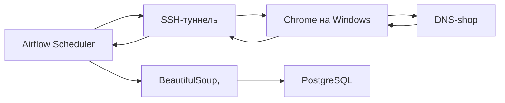
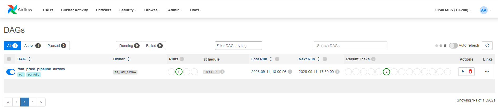
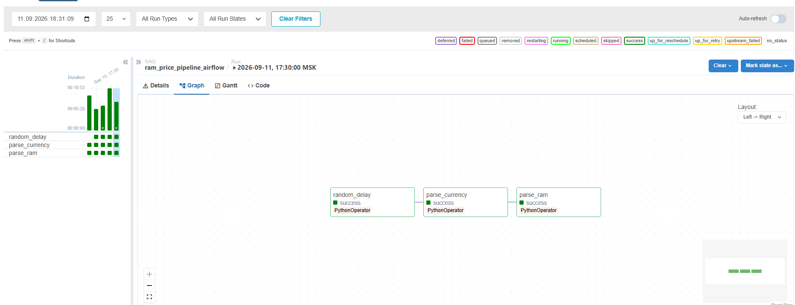
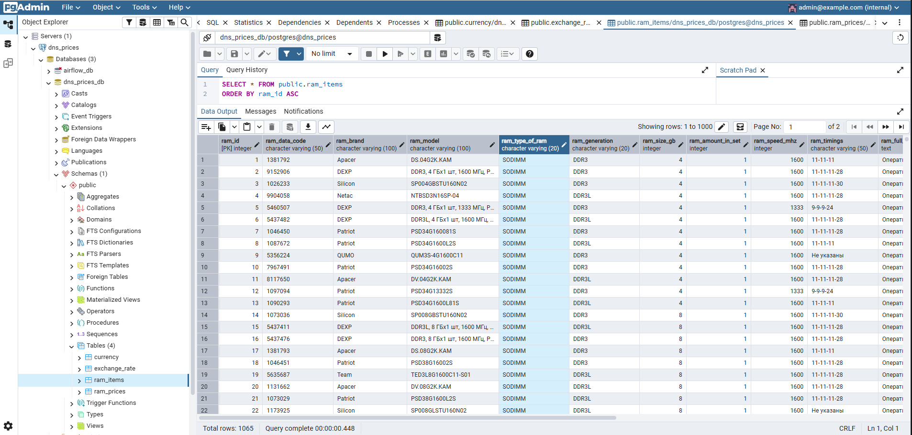
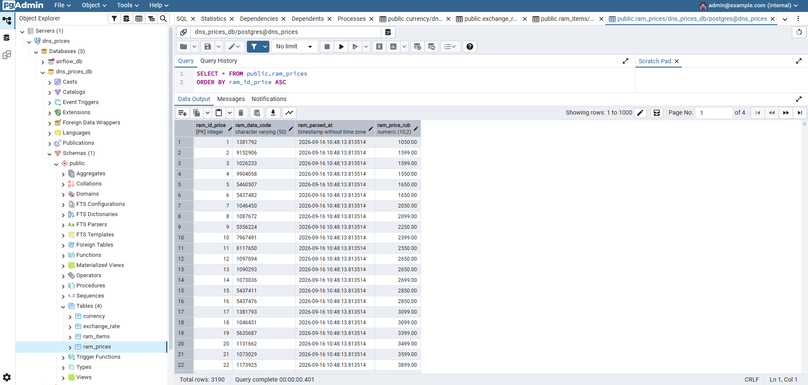
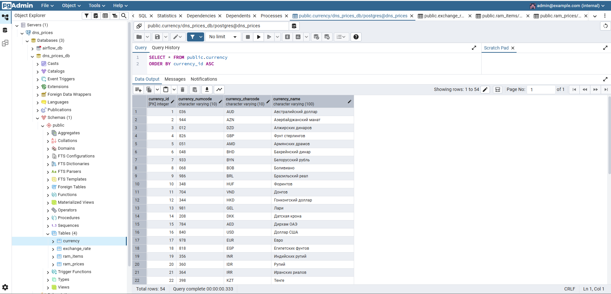
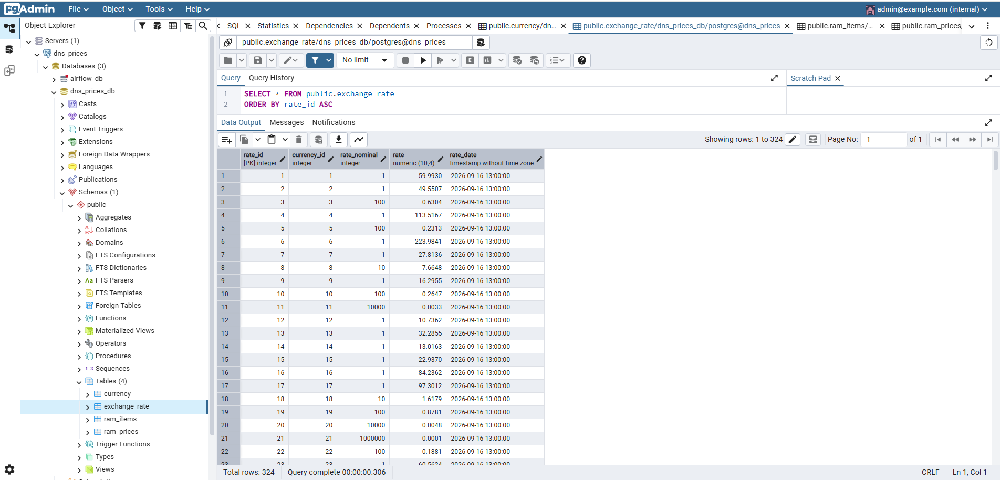
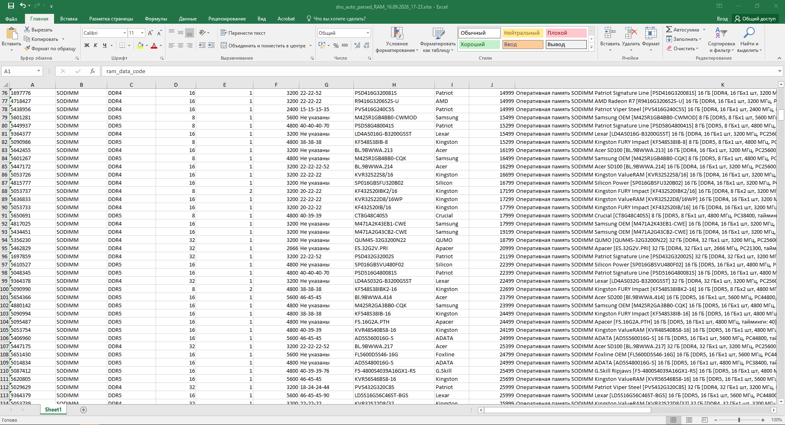

<div align="center">
  
  <h1>DNS RAM Price Parser</h1>
  <p>
    Автоматизированный инструмент для мониторинга цен на оперативную память в магазине DNS.
  </p>

  <!-- Бейджи -->
  <p>
    
    
    
    
    
  </p>
  
  <p>
    <a href="#-о-проекте">О проекте</a> •
    <a href="#-технологии">Технологии</a> •
    <a href="#-установка">Установка</a> •
    <a href="#-использование">Использование</a> •
    <a href="#-скриншоты">Скриншоты</a>
  </p>

</div>
---

## О проекте

Парсер позволяет собирать актуальные данные о стоимости оперативной памяти sodimm, dimm с сайта DNS. Инструмент полезен для отслеживания динамики цен и поиска наиболее выгодных предложений.
```bash
Обойти защиты сайта с самого docker пока не получилось, защиты отслеживают сигнатуры кастрированного linux, имитация бурной деятельности человека, эмуляция экрана, подброс живых куки, скрытые режимы playwright, прокси - не помогли. Нужен был живой браузер со следами пользователя.
```

**Есть два стула/режима работы:**

| Режим | Описание | Результат |
|-------|----------|-----------|
| **Windows** | Локальный запуск `python dns_ram_parser.py` | Данные в Excel-файл |
| **Docker/Airflow** | Ежедневный парсинг по расписанию через SSH-туннель к браузеру на Windows | Данные в PostgreSQL |


**Схема работы:**


---
## 1.Технологии

Проект построен с использованием следующего стека:

<p align="left">
  <a href="https://skillicons.dev">
    
  </a>  
  
</p>

| Категория | Инструмент | Назначение |
|-----------|------------|------------|
| Язык | Python 3.10+ | Основной язык разработки |
| Оркестрация | Apache Airflow | Планирование и запуск ETL-процессов |
| База данных | PostgreSQL 15 | Хранение исторических данных |
| Контейнеризация | Docker, Docker Compose | Развёртывание инфраструктуры |
| Парсинг | Playwright, BeautifulSoup4 | Сбор и обработка данных |
| Обработка данных | Pandas, SQLAlchemy | Трансформация и загрузка данных |

---
##  2.Скриншоты

### Airflow UI


### Граф DAG


### Данные в pgAdmin





### Результат в Excel


---
## 3.Установка

### 3.1. Клонируйте репозиторий
```bash
git clone https://github.com/v-tagaev/dns_parser__RAM_price.git
cd dns_parser__RAM_price
```

### 3.2. Создайте файл `.env`
Скопируйте шаблон и заполните своими значениями:
```bash
cp .env.example .env
```

### 3.3. Запустите контейнеры
```bash
docker compose up -d
```

### 3.4. Откройте Airflow

  - **URL:** [http://localhost:8082](http://localhost:8082)
  - **Логин:** `admin`
  - **Пароль:** `admin`
---
###  5.Планы по развитию

```bash
  - [ ] Добавить парсинг других комплектующих (SSD, GPU)
  - [ ] Добавить алерты в Telegram при изменении цен
```
---

## 6. Лицензия

- Проект распространяется под лицензией MIT. Подробности — в файле [LICENSE](LICENSE). 
- Иcпользуйте как хотите, не нарушая закон. Мне все равно

---

## 7. Примеры аналитики

После сбора данных можно строить аналитику прямо в SQL. Примеры запросов:

**Топ-5 самых дорогих модулей DDR5 для ноутов:**

```sql
SELECT ram_brand, ram_model, ram_size_gb, ram_price_rub
FROM ram_prices_usd
WHERE ram_generation = 'DDR5' and lower(ram_type_of_ram) = 'sodimm'
ORDER BY ram_price_rub DESC
LIMIT 5;
```

**Средняя цена по брендам:**

```sql
SELECT ram_brand, ROUND(AVG(ram_price_rub), 2) AS avg_price
FROM ram_prices_usd
GROUP BY ram_brand
ORDER BY avg_price DESC;
```

---
